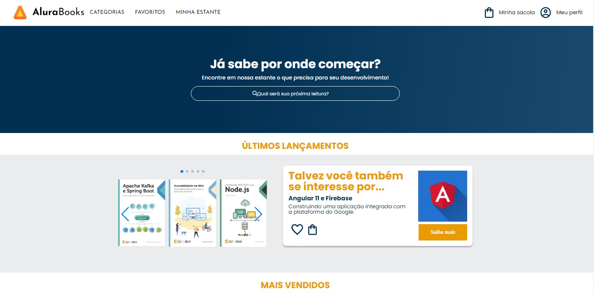

<h1 align="center"> Alura Books </h1>

Projeto feito durante o curso de responsividade da Alura. 
Totalmente responsivo tanto para mobile, tablet e desktop.

## Tecnologias

Esse projeto foi desenvolvido com as seguintes tecnologias:
- HTML e CSS
- Git e Github
- Figma

## Link da página do projeto  
<a href="https://rsantosmartins.github.io/alura-book/">Acesse o Alura Books</a>

## Projeto

O Alura Books é um web site para compras de Ebooks da Alura.

## Conteudo do curso 

* Acessar e visualizar o projeto no Figma;
* Captar informações como as cores dos elementos no Figma;
* Começar a construir um projeto HTML;
* Criar variáveis CSS;
* Usar a extensão live-server;
* Aplicar o reset.css.
* Baixar imagens no Figma;
* Construir um header;
* Transformar elementos em flex-containers e flex-items com FlexBox;
* Associar arquivos CSS através do @import;
* Desenvolver um menu hambúrguer interativo com HTML e CSS;
* Position relative e absolute;
* Importar e usar fontes do google fonts;
* Criar sections;
* Editar input e seu placeholder.
* Aplicar plugins externos através de CDN;
* Utilizar o plugin SwiperJS;
* Reforçar o aprendizado de flexbox;
* Reutilizar elementos e estilos;
* Criar listas;
* Editar input e seu placeholder.
* Usar media queries;
* Aplicar diferentes estilos para diferentes tamanhos de tela;
* Retirar elementos da tela;
* Aplicar elementos na tela de acordo com o tamanho do dispositivo.
* Aplicar estilos com media queries diferentes;
* Usar estilos diferentes no mesmo elemento com pseudo-classes.
* Construir um repositório com o código do curso;
Escrever commits;
* O que é deploy;
* Fazer deploy no Github Pages;
* Abrir o projeto em outros dispositivos.

